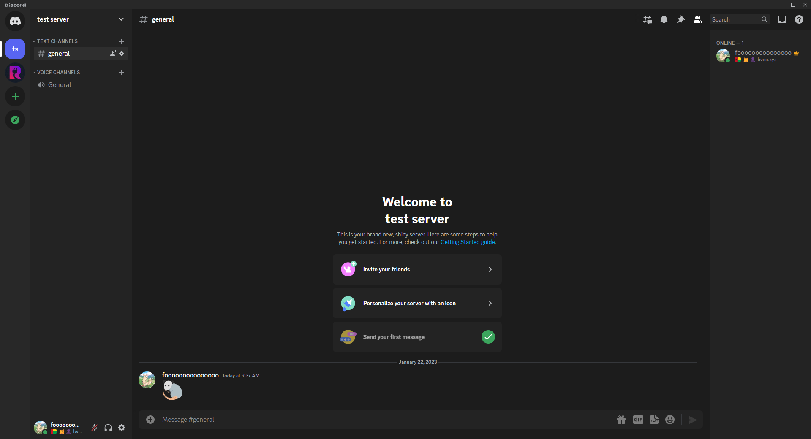
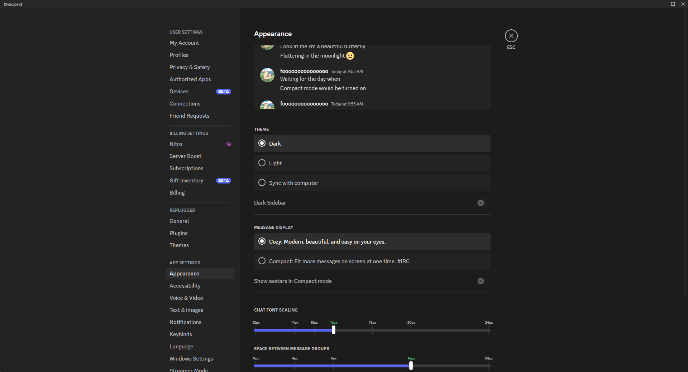

# Supabase theme for Replugged

## Installation

### **[Replugged](https://replugged.dev/)**

[](https://replugged.dev/install?identifier=fooooooooooooooo/replugged-supabase-theme&source=github)

## Screenshot





## Build

### Prerequisites

- NodeJS
- pnpm: `npm i -g pnpm`
- [Replugged](https://github.com/replugged-org/replugged#installation)

### Install

1. Clone this repository and cd into it
2. Install dependencies: `pnpm i`
3. Build the theme: `pnpm run build`
4. Reload Discord to load the theme

<!--
```sh
git tag v1.1.0
git push --tags
```
-->
